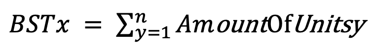
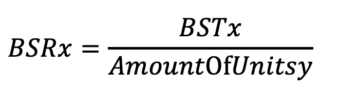
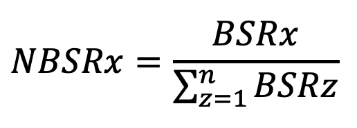
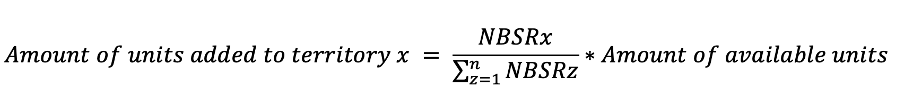
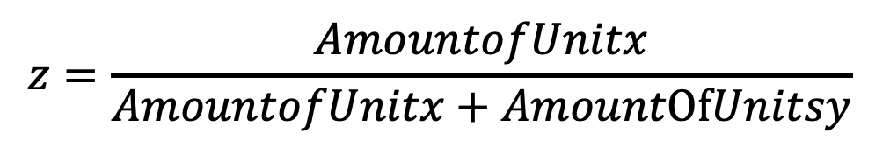
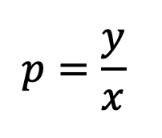

# Implementation of the Risk Game and Artificial Intelligence Agent Player

## 1. Abstract
### 1.1. Game Description
Risk is a strategy board game of diplomacy, conflict and conquest for two to
six players.
Turn rotates among players who control armies of playing pieces
with which they attempt to capture territories from other players, with results
determined by dice rolls. The goal of the game is to occupy every territory on
the board and in doing so, eliminate the other players.
Each turn consists of two actions:
1) Draft: Player gets to add certain amount of army units to any territory they own.
2) Attack: Player can choose to attack neighbor enemy territories with the number of armies they prefer in order to conquer the land.

### 1.2. Project Goals
The purpose of this project has been to implement the risk game with some changes made in the rules and to design an artificially intelligent agent that is able to play the game properly and have a very high chance of winning when facing other opponents including both actual human players or other agent players.

## 2. Game Implementation
The game is implemented using JAVA programming language. 
Controlling turns, performing player requested actions, updating the game map, checking if everything is happening according to the rules, etc., are the things that this part of the code does.
The game UI is also designed through .fxml files that draws the map and is the platform connecting player to the logic of the game.

## 3. AI player Implementation
This section focuses on the implementation and evaluation of heuristics that lead to a strong AI for the game Risk.

### 3.1 Algorithms
Implementation is based on the minimax alpha-beta pruning algorithm. Player constructs a prediction tree based on the DFS algorithm.
#### 3.1.1 Prediction Tree
Whenever it is the agent’s turn to play, a tree is made. The tree nodes
are the states of the game (map of the game in that state) and each edge is a possible attack made from current state to attack’s result state of the map. An attack action consists of start and target territories’ coordinates and the number of units chosen to be in the attacking army. The root node is the current state of the map a player has to choose it’s moves from. Although, the tree cannot predict until the ending state of the game due to large number of possible moves a player can have in each state which the memory and time limits do not allow. Therefore, player can only construct the tree to a certain depth that we have defined in the code. There are also some simplifications applied to particular parts of the agent’s gaming strategy that will be all explained in the following sections.
In order to make the best possible decision heuristics are defined for the deepest possible nodes (tree leaves) that evaluate how much reaching that state can be beneficial for the player. Said heuristics will be further explained in the report.
When the values of the leaves are determined the tree will be passed on to the minimax alpha-beta pruning and this well-known algorithm will find the best series of actions the player can have.

### 3.2. Heuristics and Simplification
#### 3.2.1. Drafting Phase
Supplying units to territories can be a tricky task; in the sense that we want to improve our attack power but also make sure of having sufficient defense power in territories that are in danger of getting attacked. Deploying units in countries adjacent to enemy territories could be a smart way of keeping balance between these two goals. 

**Draft Simplification:** 
Predicting and including all possible draft scenarios in the prediction tree will lead to a complex tree that would face the problems mentioned before; therefore, one of the simplifications made is that we use a drafting heuristic which is proved to always have the best possible result and predict that the opponents make this approach in drafting as well ; In other words , we remove the drafting results as possibilities form the prediction tree and change them to definitive draft scenarios.

In order to do so, we take the following steps: 
**Draft Heuristic:** 
**Step 1:**  
aking the summation of all units in enemy countries y adjacent to
country x will give a measure which we call Border Security Threat (BST) in x.

 

**Step 2:**  
Dividing this BST by the units situated in x gives a Border Security Ratio (BSR) which can be compared among all border countries. 
 
Countries with a high BSR are more likely to be conquered by an enemy player, since the number of enemy units in adjacent enemy countries are relatively higher than the number of units on the country itself. Choosing countries with a high BSR to supply to will increase their defensive strength by lowering the BSR. Supplying units to countries with a lower BSR, meaning that they already have a better defensive stance,
will increase their offensive strength, raising the chances of a successful attack from these countries. 

**Step 3:**  
Normalizing the BSR by dividing it by the sum of all BSRs of countries, a player owns, will give a direct measurement by which someone could arrange units. The Normalized Border Security Ratio (NBSR) is calculated by: 
 
It gives a direct ratio of how the units could be distributed among countries.
At this point we can see there would be a problem with this ratios because some data is irrelevant , and we don’t want to add units to all our territories so we set a threshold in between steps two and three by sorting the BSRx data in a descending order(we are focusing more on making the defense power stronger) , divide the data from middle and set the numbers in the lower half to zero.

**Step 4:**  
 
Step 4 will be continued until no more available units are left to add.

#### 3.2.2. Attacking Phase
There are some simplifications applied in the attack phase in order to make the tree less complicated so we can predict into deeper levels of it. This can be done by checking which attack scenarios have a higher chance to win the battle and only include them in the tree.
1. Attacksareonlyinitiatedfromterritoriesthathaveatleastoneunit more than the defending army.
2. Numberofunitsintheattackingarmycanbeonlyequaltotheaverage of all attacker and defender territories’ units rounded upwards.
3. Intheoriginalgametheresultofattackisbasedondicesand...buthere we assume if attacker participates in the battle with a units and defender with d units and a definitely greater than d, attacker will win the game and there will be a-d units left for it. This means that we are removing many possible nodes to one definite node.
4. Player in each turn can have between zero to maximum three attacks and assumes the opponents do the same as well.

#### 3.2.3. Prediction Tree Heuristics
In order to evaluate how beneficial a tree leaf is for that specific player; we have defined four heuristic features which their best possible weights are found during the learning of the heuristic which will be explained later. All features return a result between zero to one because when the features are valued in close ratios to each other, the learning and assigning weight would be more accurate.

The features are:
1. Theratioofthenumberofalltheterritoriesaplayerownstoall
territories that the map has.
2. Theratioofthenumberofalltheunitsaplayerownstoallunitsthatare
in the map.
3. Foreachterritoryxtheplayerowns,foreachenemyterritoryyadjacent
to it we calculate : 
 
After that we calculate the average of all z’s and the result is the third feature we use. It shows our defensive power and the closer it gets to one it shows we’ve got higher defensive strength.
4. Foreachterritoryxtheplayerowns,ifyisnumberofneighborenemy territories, and z is the number of neighbor territories the player owns , p will be calculated : 
 
After that we calculate the average of all p’s = AVGp.
(1 – AVGp) indicates how dense and close together our territories are which the higher the better because a winning strategy for this game for example when there are continents, is to focus on one continent and to conquer it all and then move to other continents.

### 3.3. Learning and Genetic
Giving weight to each of the heuristics in the previous part helps evaluate how important and influential each of them is for an agent to win the game.
The process of finding these weights is through Genetic and Learn.
Each gene is a set of four weights for those four features. We start by generating 100 set of random weights in range [0,10]. After that ,10 tournaments will happen. For each tournament 10 genes from the primary population will be selected randomly. Every possible pairs of genes will play against each other and the result of each game in each tournament will be documented.
Fitness Function is defined as (number of wins / number of games) for each gene. The three top genes in each tournament (based on the fitness function) will be selected so now we have 30 top selected genes. Among these we select 12 random pairs and for each pair perform a crossover which is creating new gene by calculating the average weight of the pair of genes. Therefore, we now have 12 new genes out of this crossover. On the other hand 3 genes are randomly selected within the 30 genes we had and mutate them by changing one random weight of each to another random weight in range [0,10].
After all this we now have 15 brand new genes that are put in the primary population, replacing the 15 least good ones we already had in there. At this point the second generation of genes are generated.
This process will continue to repeat until generation 4 of genes are generated. The top gene in that population will be selected as our best weights for the features of our heuristic that the agent will use to play.

